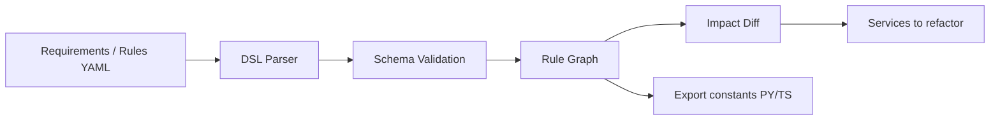

# business-semantic-layer

**Versioned, language-agnostic business rules — with change impact you can
act on.**

PM requirements and code drift apart because the *language* of the rule
lives in tickets while the *implementation* lives in five services. This
package keeps the rule itself as data:

```yaml
- id: checkout.free-shipping
  version: 2
  statement: Orders of $50 or more ship free.
  when:
    - field: cart.subtotal
      op: ge
      value: 50
  then:
    - field: cart.shipping_price
      op: eq
      value: 0
  entities: [cart, shipping]
  affected_services: [checkout-api, shipping-service, storefront-web]
```

When you change the file, `bsl impact` tells you **which rules changed** and
**which services to refactor** — before the PR review starts.

## Architecture



## Install

```bash
pip install -e ".[dev]"
```

Python 3.11+. Runtime dependencies: **none** (stdlib only, including a small
YAML-subset parser). Tests use `pytest`.

## CLI

```bash
# Schema-validate a rule document
bsl validate examples/checkout_v1.yaml

# Diff two rule sets: changed rules + services to refactor
bsl impact examples/checkout_v1.yaml examples/checkout_v2.yaml

# Field-level rule diff for PR review
bsl diff examples/checkout_v1.yaml examples/checkout_v2.yaml

# Same, as a Markdown report for the PR description
bsl impact examples/checkout_v1.yaml examples/checkout_v2.yaml \
    --format markdown -o impact.md

# Emit importable constants
bsl export examples/checkout_v1.yaml --lang python
bsl export examples/checkout_v1.yaml --lang typescript

# CI gate: non-zero exit when any rule drifted
bsl impact old.yaml new.yaml --fail-on-impact
```

See [docs/PM_TO_REFACTOR.md](docs/PM_TO_REFACTOR.md) for an end-to-end
walkthrough from a PM request to a refactor checklist, and
[docs/PUBLIC_API.md](docs/PUBLIC_API.md) for the 0.x compatibility promise
and typed exceptions.

## Rule schema

| Field | Type | Required | Notes |
| --- | --- | --- | --- |
| `id` | slug | yes | Stable identity, e.g. `checkout.min-order` |
| `version` | int ≥ 1 | yes | Bump when the rule *meaning* changes |
| `statement` | string | yes | English the PM signed off on |
| `when` | condition[] | no | All must hold for the rule to apply |
| `then` | condition[] | no | Effects / assertions when it applies |
| `entities` | string[] | no | Domain entities read/written |
| `affected_services` | string[] | no | Services that must track this rule |
| `enabled` | bool | no | Default `true` |
| `metadata` | map | no | owner, jira, anything else |

### Condition ops

`eq`, `ne`, `lt`, `le`, `gt`, `ge`, `in`, `not_in`, `contains`, `exists`,
`not_exists`, `is_true`, `is_false`.

`exists` / `not_exists` / `is_true` / `is_false` do not require `value`.

## What `bsl impact` reports

Given old and new rule sets:

- **added** — new rule ids
- **removed** — ids that disappeared
- **changed** — same id, different `statement` / `when` / `then` / `entities` /
  `affected_services` / `enabled` / `version`
- **unchanged** — identical content and version
- **services to refactor** — union of `affected_services` on every added,
  removed, or changed rule

## What `bsl diff` reports

A field-level human-readable diff for PR review:

- rule-set name/version header
- `+ added` / `- removed` / `~ changed` blocks
- statement and when/then condition deltas as `-` / `+` lines
- services-to-refactor list

Use `--show-unchanged` to also list rules that did not move.

## Library use

```python
from business_semantic_layer import (
    parse_document, validate_raw, RuleSet, analyze_impact,
    export_markdown_report, export_python_constants,
)

old = RuleSet.from_dict(parse_document(open("old.yaml").read()))
new = RuleSet.from_dict(parse_document(open("new.yaml").read()))
impact = analyze_impact(old, new)
print(impact.format_summary())
print(export_markdown_report(impact, old=old, new=new))
```

## Honest scope

| This project IS | This project is NOT |
| --- | --- |
| A versioned rule DSL + validator | A runtime rules engine |
| A change-impact analyzer | A code rewriter / automatic refactor |
| Constant stubs for Python / TS | A full multi-language codegen |
| Stdlib YAML-subset + JSON | Full YAML 1.2 (no anchors, multi-line strings) |

If you need anchors or folded scalars, store the rules as JSON or extend
`dsl.parse_yaml_subset`.

## Development

```bash
pip install -e ".[dev]"
pytest -v
```

## License

MIT — see [LICENSE](LICENSE).
